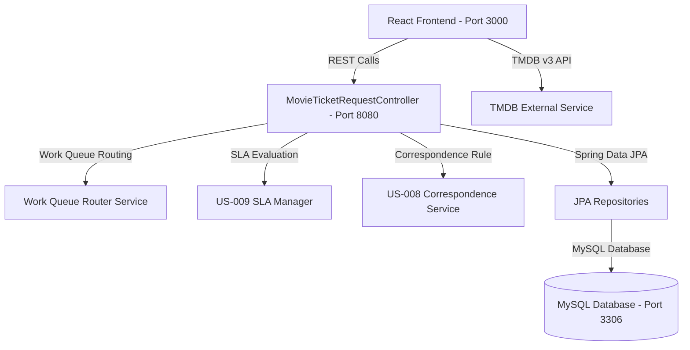

# 🎬 CineSpot - Movie Ticket Booking & Case Management System

> **Your Next Show Awaits.** A modern, full-stack Movie Ticket Booking & Enterprise Case Management web application designed for cinema browsing, dynamic session selection, real-time seat reservation, automated work queue routing, SLA monitoring, and structured correspondence rules.

---

## 📝 Project Description

**CineSpot** is an enterprise full-stack movie ticket booking and case management application created by **Anil Upputuri**. Built with **React 18** for a dynamic user interface and **Java Spring Boot 3.2** for a robust backend, CineSpot manages the end-to-end lifecycle of movie ticket requests through defined case stages, SLAs, work queue routing, and automated correspondence notifications.

Users can browse trending movies, filter by genres, view screening schedules, pick hall seats, track live order status, and receive structured email correspondence receipts upon booking completion.

---

## ✨ Key Features

- **🎟️ Movie Ticket Request Case Management**: Multi-stage lifecycle processing (`Initiation` → `Verification` → `Approval` → `Booking Execution` → `Correspondence Resolution`).
- **⏱️ US-009 Booking SLA Rules**:
  - **SLA Goal**: 1 Day
  - **SLA Deadline**: 2 Days
  - **Automated Escalation**: When deadline is breached, case priority automatically increases from `10` to `30` (+20 urgency boost).
- **⚙️ Route Booking Request by Show Type**:
  - `IMAX 3D` / 3D Movies → `IMAX_PREMIUM_WORK_QUEUE`
  - `VIP Luxury` → `VIP_CONCIERGE_WORK_QUEUE`
  - Morning/Matinee shows → `MATINEE_OPERATIONS_WORK_QUEUE`
  - Standard shows → `STANDARD_BOOKING_WORK_QUEUE`
- **📩 US-008 Automated Correspondence Notification**:
  - Executes a predefined Correspondence rule upon case resolution to dispatch structured emails containing Case ID, Movie Name, Show Date & Time, Ticket Count, Seat Numbers, and Total Cost.
- **🖤 Interactive User Profile Drawer**:
  - **Your Orders & Track**: Live order tracking with Case ID, Ticket ID (`TCK-XXXXXX`), Work Queue, SLA status, and allocated seats.
  - **Notifications**: Structured email correspondence records.
  - **Wishlist**: Saved favorite movies.
  - **Stream Library**: Digital cinema passes (HD/4K).
  - **Help & Support**: FAQ accordion and customer support chat assistant.
  - **Accounts & Settings**: Update mobile number, email, location, and notification preferences.
  - **Rewards**: CineSpot Club Reward points (450 PTS), Gold Tier status, and active discount coupons (`CINESPOT50`).
- **💺 Interactive Seat Allocation**: Cinema hall seat grid featuring real-time selection, occupancy state updates, and seat recommendation algorithms.
- **🔐 Authentication**: Account authentication alongside Google OAuth 2.0 / Firebase profile management.

---

## 🛠️ Tech Stack

### Frontend
- **Framework**: React 18
- **Styling**: TailwindCSS, Vanilla CSS3 (Custom Dark & Glassmorphism Design Tokens)
- **Icons & Assets**: Lucide React Icons
- **API Integration**: Fetch API, TMDB v3 API

### Backend
- **Framework**: Java 23 / 21, Spring Boot 3.2.4
- **Security**: Spring Security 6.2, JWT, Google OAuth 2.0, Firebase Auth
- **Persistence**: Spring Data JPA / Hibernate
- **Database**: MySQL 8.0+

### DevOps & Tools
- **Version Control**: Git & GitHub
- **Build Tools**: Maven (`mvnw`), npm
- **Environment Management**: `dotenv`, `env-cmd`

---

## 📁 Project Structure

```
Movie Ticket Booking/
├── backend/                        # Spring Boot REST API
│   ├── src/main/java/com/cinema/backend/
│   │   ├── config/                # Security & CORS configuration
│   │   ├── controllers/           # REST Controllers (MovieTicketRequest, Orders, Auth)
│   │   ├── models/                # Entities (MovieTicketRequest, Order, User, CinemaHall)
│   │   ├── repositories/          # Spring Data JPA Repositories
│   │   └── services/              # Business Logic, Work Queue Routing & Correspondence Rules
│   ├── src/main/resources/
│   │   └── application.properties # Spring Boot database & JPA properties
│   └── pom.xml                    # Maven build configuration
│
├── frontend/                       # React SPA Application
│   ├── public/                    # Static assets & index.html (CineSpot copy.png)
│   ├── src/
│   │   ├── API/                   # API wrappers for movie ticket requests & TMDB
│   │   ├── components/            # UI Components (UserProfileDrawer, SeatPlan, LoginForm, etc.)
│   │   ├── layout/                # Page Layouts (NavBar, Footer)
│   │   ├── mockData/              # Screening schedules & sessions
│   │   └── firebaseConfig.js      # Firebase authentication initialization
│   └── package.json               # NPM dependencies & scripts
│
└── README.md                       # Placement-ready documentation
```

---

## 🏗️ System Architecture



---

## 🚀 Installation & Setup

### Prerequisites
- **Node.js**: v18.0 or higher
- **Java JDK**: Version 21 or 23
- **MySQL Server**: v8.0 or higher
- **Git**: Installed on system

### 1. Clone the Repository
```bash
git clone https://github.com/UpputuriAnil/CineSpot.git
cd CineSpot
```

### 2. Configure Environment Variables
Set PowerShell environment variables or create a `.env` file in the project directory (see [Environment Variables](#-environment-variables)).

### 3. Backend Setup (Spring Boot)
```bash
cd backend
# Set JAVA_HOME: $env:JAVA_HOME="C:\Program Files\Java\jdk-23"
.\mvnw.cmd spring-boot:run
```
> The Spring Boot backend server will start at `http://localhost:8080`

### 4. Frontend Setup (React)
Open a new terminal window:
```bash
cd frontend
npm install
npm start
```
> The React development server will start at `http://localhost:3000`

---

## 🔑 Environment Variables

Set environment variables in PowerShell or local `.env` file:

```env
# Backend Database Configuration
DB_URL=jdbc:mysql://127.0.0.1:3306/cinema
DB_USERNAME=root
DB_PASSWORD=@Nil@2004

# Frontend TMDB API Configuration
REACT_APP_API_KEY=your_tmdb_api_key
REACT_APP_ACCESS_TOKEN=your_tmdb_access_token
REACT_APP_BASE_URL=http://localhost:8080/api/v1
```

---

## 🗄️ Database Setup

1. Start your local MySQL server on port `3306`.
2. Create the database named `cinema`:
   ```sql
   CREATE DATABASE cinema;
   ```
3. Spring Boot JPA will automatically generate and update tables (`spring.jpa.hibernate.ddl-auto=update`).

---

## 📡 API Documentation

| Method | Endpoint | Description | Access |
| :--- | :--- | :--- | :--- |
| `POST` | `/api/v1/movie-ticket-request` | Create new Movie Ticket Request case | Public |
| `GET` | `/api/v1/movie-ticket-request` | Fetch all ticket request cases | Authenticated |
| `GET` | `/api/v1/movie-ticket-request/{id}` | Fetch specific case details | Authenticated |
| `PUT` | `/api/v1/movie-ticket-request/{id}/execute-booking` | Execute seat allocation & complete booking | Authenticated |
| `GET` | `/api/v1/movie-ticket-request/{id}/sla` | Evaluate US-009 SLA status & urgency | Authenticated |
| `GET` | `/api/v1/notifications` | Fetch US-008 correspondence email logs | Authenticated |

---

## 📸 Screenshots

### 🎬 CineSpot Frontend Application Interface & Catalog


---

## 🌐 Live Demo

- **Local Development**: `http://localhost:3000`
- **GitHub Repository**: [https://github.com/UpputuriAnil/CineSpot](https://github.com/UpputuriAnil/CineSpot)

---

## 📖 How to Use

1. **Explore Movies**: Browse trending titles on the homepage or filter by genre.
2. **Select Showtime & Seat**: Choose your preferred date, cinema hall slot, and select seats on the interactive grid.
3. **Review & Confirm Booking**: Submit your booking request case to execute seat allocation.
4. **Track Orders & SLA**: Open the profile drawer to view ticket IDs, routed work queues, and US-009 SLA status.
5. **Check Correspondence**: Inspect automated email dispatches in the Notifications tab.

---

## 🔮 Future Enhancements

- [ ] Integrated Online Payment Gateway (Razorpay / Stripe)
- [ ] QR Code Generation for digital e-tickets
- [ ] Admin Dashboard for hall management and revenue analytics
- [ ] Push Notifications for upcoming movie showtime reminders

---

## 👨‍💻 Contributors

- **Anil Upputuri** - *Full-Stack Architecture & Development* - [UpputuriAnil](https://github.com/UpputuriAnil)

---

## 📄 License

This project is licensed under the MIT License.

---

© 2026 **Anil Upputuri**. All rights reserved.
