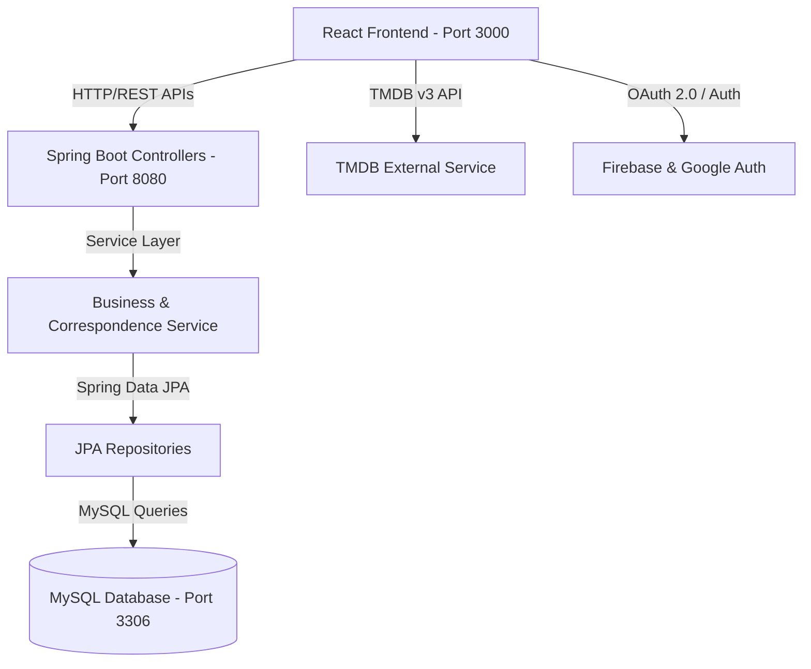
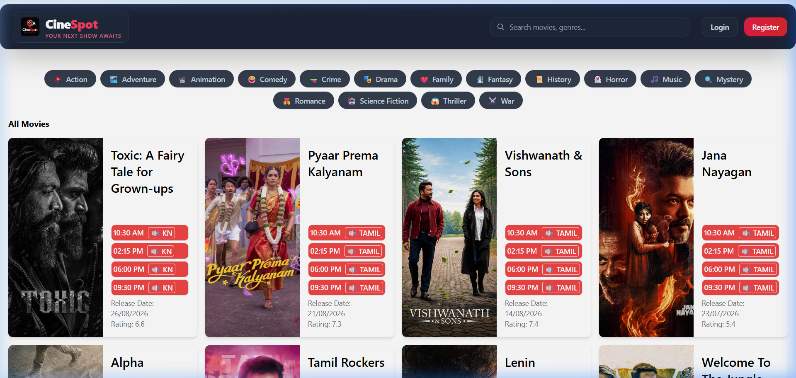

# 🎬 CineSpot - Movie Ticket Booking System

> **Your Next Show Awaits.** A modern, full-stack Movie Ticket Booking web application designed for seamless cinema browsing, dynamic session selection, real-time seat reservation, and secure user management.

---

## 📝 Project Description

**CineSpot** is an end-to-end full-stack movie ticket booking web application created by **Anil Upputuri**. Built with **React** for a dynamic, responsive user interface and **Java Spring Boot 3.2** for a robust, enterprise-grade RESTful API backend, CineSpot delivers a premium cinema booking experience.

Users can browse trending movies powered by TMDB API integration, filter by genres, view screening schedules, interactively select hall seats with automated recommendation algorithms, manage user profiles, and send booking requests.

---

## ✨ Features

- **🔐 Authentication & User Security**: Local account authentication (JWT/BCrypt) alongside Google OAuth 2.0 / Firebase authentication with profile drawer management.
- **🍿 Dynamic Movie Catalog**: Real-time popular, top-rated, and upcoming movie feeds integrated with The Movie Database (TMDB) API.
- **🏷️ Multi-Genre Filtering**: Quick genre navigation (Action, Drama, Comedy, Sci-Fi, Romance, Thriller, etc.).
- **🎟️ Interactive Seat Selection**: Visual cinema hall seat plan featuring seat selection state, occupancy status, and seat recommendation algorithms.
- **📅 Session & Hall Management**: Multiple screening slots per movie across specialized cinema halls.
- **💰 Localized Rupee Pricing (₹)**: Currency localization tailored for Indian cinema pricing.
- **📩 Correspondence & Case Management**: Automated email/notification dispatch rule service upon booking request resolution.
- **📱 Fully Responsive UI**: Glassmorphism aesthetic, dark-themed UI built with React & TailwindCSS.

---

## 🛠️ Tech Stack

### Frontend
- **Framework**: React 18
- **Styling**: TailwindCSS, Vanilla CSS3 (Custom Glassmorphism Tokens)
- **Icons & Assets**: Lucide React Icons
- **API Integration**: Fetch API, TMDB v3 API

### Backend
- **Framework**: Java 21, Spring Boot 3.2.4
- **Security**: Spring Security 6.2, JWT, Google OAuth 2.0, Firebase Auth
- **Persistence**: Spring Data JPA / Hibernate
- **Database**: MySQL 8.0+

### DevOps & Tools
- **Version Control**: Git & GitHub
- **Build Tools**: Maven (`mvnw`), npm
- **Environment Management**: `dotenv`, `env-cmd`

---

## 📁 Project Structure

```
Movie Ticket Booking/
├── backend/                        # Spring Boot REST API
│   ├── src/main/java/com/cinema/backend/
│   │   ├── config/                # Security & CORS configuration
│   │   ├── controllers/           # REST Endpoints (Movie, User, Show, Seat, Order)
│   │   ├── models/                # JPA Entities (Movie, User, Show, Order, TicketRequest)
│   │   ├── repositories/          # Spring Data JPA Repositories
│   │   └── services/              # Business Logic & Correspondence Services
│   ├── src/main/resources/
│   │   └── application.properties # Spring Boot environment config
│   └── pom.xml                    # Maven dependencies
│
├── frontend/                       # React SPA Application
│   ├── public/                    # Static assets & index.html
│   ├── src/
│   │   ├── API/                   # API call handlers & TMDB wrappers
│   │   ├── components/            # Reusable UI components (NavBar, SeatPlan, etc.)
│   │   ├── layout/                # Page layouts (Header, Footer)
│   │   ├── mockData/              # Screening schedules & sessions
│   │   ├── pages/                 # Main views (Home, MovieDetails, Booking)
│   │   └── firebaseConfig.js      # Firebase authentication initialization
│   └── package.json               # NPM dependencies & scripts
│
└── .env                            # Local environment variable secrets (Ignored in Git)
```

---

## 🏗️ System Architecture



---

## 🚀 Installation & Setup

### Prerequisites
- **Node.js**: v18.0 or higher
- **Java JDK**: Version 21
- **MySQL Server**: v8.0 or higher
- **Git**: Installed on system

### 1. Clone the Repository
```bash
git clone https://github.com/UpputuriAnil/CineSpot.git
cd CineSpot
```

### 2. Configure Environment Variables
Create a `.env` file in the root project directory (see [Environment Variables](#-environment-variables) section below).

### 3. Backend Setup (Spring Boot)
```bash
cd backend
# Set JAVA_HOME if necessary: $env:JAVA_HOME="C:\Program Files\Java\jdk-23"
./mvnw spring-boot:run
```
> The Spring Boot backend server will start at `http://localhost:8080`

### 4. Frontend Setup (React)
Open a new terminal window:
```bash
cd frontend
npm install
npm start
```
> The React development server will start at `http://localhost:3000`

---

## 🔑 Environment Variables

Create a `.env` file in the root folder (`Movie Ticket Booking/.env`):

```env
# Backend Database Configuration
DB_URL=jdbc:mysql://127.0.0.1:3306/cinema
DB_USERNAME=root
DB_PASSWORD=your_mysql_password

# Frontend TMDB API Configuration
REACT_APP_API_KEY=your_tmdb_api_key
REACT_APP_ACCESS_TOKEN=your_tmdb_access_token
REACT_APP_BASE_URL=http://localhost:8080/api/v1

# Firebase Configuration Credentials
REACT_APP_FIREBASE_API_KEY=your_firebase_api_key
REACT_APP_FIREBASE_AUTH_DOMAIN=your_project.firebaseapp.com
REACT_APP_FIREBASE_PROJECT_ID=your_project_id
REACT_APP_FIREBASE_STORAGE_BUCKET=your_project.appspot.com
REACT_APP_FIREBASE_MESSAGING_SENDER_ID=your_sender_id
REACT_APP_FIREBASE_APP_ID=your_app_id

# Google Cloud OAuth 2.0 Client Credentials
REACT_APP_GOOGLE_CLIENT_ID=your_google_client_id.apps.googleusercontent.com
GOOGLE_CLIENT_SECRET=your_google_client_secret
```

---

## 🗄️ Database Setup

1. Start your local MySQL server on port `3306`.
2. Create the database named `cinema`:
   ```sql
   CREATE DATABASE cinema;
   ```
3. Update `DB_USERNAME` and `DB_PASSWORD` in your root `.env` file.
4. Spring Boot JPA will automatically create and update tables (`spring.jpa.hibernate.ddl-auto=update`) upon application launch.

---

## 📡 API Documentation

### Main Endpoints Summary

| Method | Endpoint | Description | Access |
| :--- | :--- | :--- | :--- |
| `POST` | `/api/v1/auth/register` | Register new user account | Public |
| `POST` | `/api/v1/auth/login` | Authenticate user & get session | Public |
| `POST` | `/api/v1/auth/google` | Google Cloud OAuth authentication | Public |
| `GET` | `/api/v1/movies` | Fetch all movies from backend DB | Public |
| `GET` | `/api/v1/shows/{movieId}` | Get screening schedules for a movie | Public |
| `POST` | `/api/v1/orders` | Create ticket reservation order | Authenticated |
| `GET` | `/api/v1/notifications/{userId}`| Fetch user correspondence alerts | Authenticated |

---

## 📸 Screenshots

### 🎬 CineSpot Frontend Application Catalog & Interface


---

## 🌐 Live Demo

- **Local Development**: `http://localhost:3000`
- **GitHub Repository**: [https://github.com/UpputuriAnil/CineSpot](https://github.com/UpputuriAnil/CineSpot)

---

## 📖 How to Use

1. **Explore Movies**: Browse trending titles on the homepage or filter by genre (Action, Comedy, Sci-Fi, etc.).
2. **View Movie Details**: Click on a movie card to inspect release dates, ratings, and synopsis.
3. **Select Screening**: Choose your preferred date, cinema hall, and showtime.
4. **Choose Seats**: Interactively pick available seats or use automated seat recommendation.
5. **Complete Booking**: Confirm ticket details and submit your reservation.
6. **Manage Account**: View profile details and active booking notifications in the user drawer.

---

## 🔮 Future Enhancements

- [ ] Integrated Online Payment Gateway (Razorpay / Stripe)
- [ ] QR Code Generation for digital e-tickets
- [ ] Admin Dashboard for hall management and revenue analytics
- [ ] Push Notifications for upcoming movie showtime reminders

---

## 👨‍💻 Contributors

- **Anil Upputuri** - *Initial Work & Full-Stack Development* - [UpputuriAnil](https://github.com/UpputuriAnil)

---

## 📄 License

This project is licensed under the MIT License.

---

© 2026 **Anil Upputuri**. All rights reserved.
